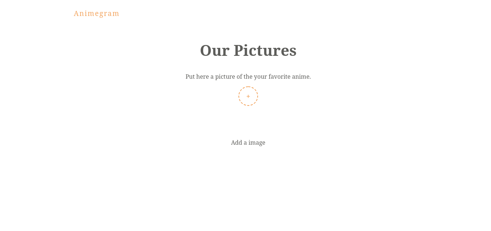

# Animegram

> That's a simple project to learn how I can use two firebase functionality, storage and firestore. Of course, I need more experience, but for a first contact I think that it's good

**PS**: This project was created through of the videos on this [Firebase Firestore Tutorial - The Net Ninja](https://www.youtube.com/playlist?list=PL4cUxeGkcC9itfjle0ji1xOZ2cjRGY_WB)